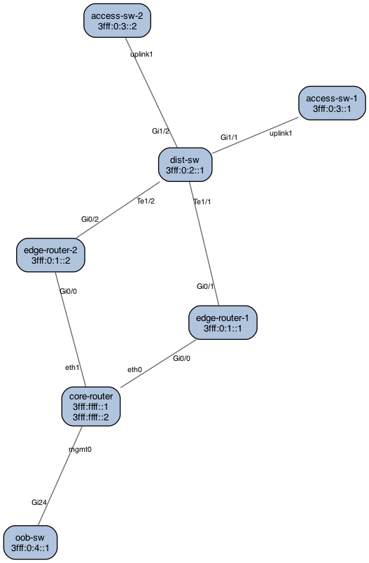

# lldp2map

A Go CLI tool that recursively walks SNMP LLDP neighbor tables across network devices and generates a topology diagram as PNG, PDF, Draw.io, or Excalidraw.

## Features

- **SNMPv2c and SNMPv3** support (MD5/SHA/SHA256/SHA512 auth; DES/AES/AES192/AES256 priv)
- **Recursive BFS discovery** — follows management addresses from each LLDP neighbor
- **Interface address labels** — optionally annotate each node with its IPv4/IPv6 addresses via `--show-addrs`
- **Four output formats** — PNG and PDF (via Graphviz), Draw.io XML, Excalidraw JSON
- Configurable hop depth, timeout, retries, and port
- Port labels on edges (local port → remote port)
- Full IPv6 support for both SNMP transport and LLDP management address discovery

## Requirements

- Go 1.21+
- [Graphviz](https://graphviz.org) (`dot` binary must be in PATH) — required for PNG/PDF output only

```bash
# macOS
brew install graphviz

# Debian / Ubuntu
sudo apt install graphviz

# RHEL / Fedora
sudo dnf install graphviz
```

## Build

```bash
git clone https://github.com/buraglio/lldp2map.git
cd lldp2map
go build -o lldp2map .
```

Or install directly to `$GOPATH/bin`:

```bash
go install github.com/buraglio/lldp2map@latest
```

## Usage

```
lldp2map <host> [flags]
```

### Flags

| Flag | Default | Description |
| --- | --- | --- |
| `-c, --community` | `public` | SNMPv2c community string |
| `-v, --version` | `2c` | SNMP version: `2c` or `3` |
| `--username` | | SNMPv3 username |
| `--auth-proto` | `SHA` | SNMPv3 auth protocol: `MD5`, `SHA`, `SHA256`, `SHA512` |
| `--auth-pass` | | SNMPv3 authentication passphrase |
| `--priv-proto` | `AES` | SNMPv3 priv protocol: `DES`, `AES`, `AES192`, `AES256` |
| `--priv-pass` | | SNMPv3 privacy passphrase |
| `--sec-level` | `authpriv` | SNMPv3 security level: `noauth`, `auth`, `authpriv` |
| `--port` | `161` | SNMP UDP port |
| `--timeout` | `5` | SNMP timeout in seconds |
| `--retries` | `2` | SNMP retries per request |
| `--max-hops` | `10` | Maximum BFS depth for recursive discovery |
| `--show-addrs` | `false` | Annotate nodes with interface IPv4/IPv6 addresses (walks IP-MIB on each device) |
| `-o, --output` | `network-map.png` | Output file path |
| `-f, --format` | `png` | Output format: `png`, `pdf`, `drawio`, `excalidraw` |

### Examples

**SNMPv2c, default community:**
```bash
lldp2map -c public 3fff::1
```

**SNMPv2c, PDF output, limit to 3 hops:**
```bash
lldp2map -c public -f pdf -o topology.pdf --max-hops 3 3fff::1
```

**SNMPv3 with auth and privacy (recommended):**
```bash
lldp2map -v 3 \
  --username netops \
  --auth-proto SHA \
  --auth-pass MyAuthPass \
  --priv-proto AES \
  --priv-pass MyPrivPass \
  --sec-level authpriv \
  -o network.png \
  3fff:1::1
```

**SNMPv3 auth-only, show interface addresses:**
```bash
lldp2map -v 3 \
  --username monitor \
  --auth-proto SHA256 \
  --auth-pass MyAuthPass \
  --sec-level auth \
  --show-addrs \
  3fff:1::1
```

**Export to Draw.io:**
```bash
lldp2map -c public -f drawio 3fff::1
```

**Export to Excalidraw:**
```bash
lldp2map -c public -f excalidraw 3fff::1
```

## Example Output



The diagram above was generated from a synthetic topology using `lldp2map --show-addrs`. Each node shows the device name and, when `--show-addrs` is set, its interface addresses. Port labels appear near the originating device on each link.

## How It Works

1. Connects to the seed device via SNMP and walks the LLDP-MIB remote neighbor table
2. Extracts neighbor system names, local/remote port descriptions, and management addresses (IPv4 and IPv6)
3. Enqueues each discovered management address into a BFS queue for recursive discovery
4. Optionally walks the IP-MIB address table (`--show-addrs`) to collect all interface addresses per device
5. Repeats until the queue is empty or `--max-hops` depth is reached
6. Renders the completed graph to the requested output format

### Interface Address Discovery (`--show-addrs`)

When `--show-addrs` is set, each device is additionally queried for its full interface address list using the IP-MIB:

- **Primary**: `ipAddressTable` (RFC 4293, `1.3.6.1.2.1.4.34`) — covers both IPv4 and IPv6
- **Fallback**: `ipAddrTable` (RFC 1213, `1.3.6.1.2.1.4.20`) — IPv4 only, used if the modern table is unavailable

Loopback (`127.0.0.0/8`, `::1`) and link-local (`fe80::/10`) addresses are excluded. All other unicast addresses are shown in the node label.

### Output Formats

| Format | Flag | Extension | Requires |
| --- | --- | --- | --- |
| PNG | `png` | `.png` | Graphviz |
| PDF | `pdf` | `.pdf` | Graphviz |
| Draw.io | `drawio` | `.drawio` | Nothing |
| Excalidraw | `excalidraw` | `.excalidraw` | Nothing |

Draw.io and Excalidraw exports use a circular layout computed by lldp2map. Nodes can be freely repositioned in the editor after import. Draw.io edges re-route automatically when nodes are moved; Excalidraw lines do not (re-run the tool or drag endpoints manually).

### LLDP MIB OIDs

| OID | Name | Purpose |
| --- | --- | --- |
| `1.0.8802.1.1.2.1.3.3.0` | lldpLocSysName | Local device hostname |
| `1.0.8802.1.1.2.1.3.7.1.4` | lldpLocPortDesc | Local port descriptions |
| `1.0.8802.1.1.2.1.4.1.1.7` | lldpRemPortId | Remote port identifier |
| `1.0.8802.1.1.2.1.4.1.1.8` | lldpRemPortDesc | Remote port description |
| `1.0.8802.1.1.2.1.4.1.1.9` | lldpRemSysName | Remote system name |
| `1.0.8802.1.1.2.1.4.2.1.3` | lldpRemManAddrIfId | Remote management addresses |
| `1.3.6.1.2.1.4.34.1.3` | ipAddressIfIndex | Interface addresses, IPv4+IPv6 (RFC 4293) |
| `1.3.6.1.2.1.4.20.1.1` | ipAdEntAddr | Interface addresses, IPv4 only (RFC 1213, fallback) |

## Project Structure

```
lldp2map/
├── main.go                       # Entry point
├── cmd/root.go                   # CLI flags and discovery loop
├── internal/
│   ├── snmp/client.go            # SNMP v2c/v3 client (gosnmp)
│   ├── lldp/walker.go            # LLDP MIB walker, OID parser, IP address walker
│   ├── graph/topology.go         # In-memory topology graph
│   └── render/
│       ├── layout.go             # Circular layout engine (shared)
│       ├── graphviz.go           # PNG/PDF via Graphviz dot
│       ├── drawio.go             # Draw.io XML export
│       └── excalidraw.go         # Excalidraw JSON export
├── go.mod
└── go.sum
```

## Dependencies

- [github.com/gosnmp/gosnmp](https://github.com/gosnmp/gosnmp) — SNMP v2c/v3
- [github.com/spf13/cobra](https://github.com/spf13/cobra) — CLI framework

## Caveats

- Recursive discovery requires that LLDP management addresses are populated on the device. Neighbors without management addresses are included in the map but not recursed into.
- Duplicate edges (A→B and B→A) are automatically deduplicated.
- If `lldpLocSysName` is not available, the device IP is used as the node label.
- `--show-addrs` adds one extra SNMP walk per visited device. On large networks this increases discovery time.
- Devices with SNMP ACLs must permit access from the host running lldp2map (you do have SNMP ACLs, right?).
- Example addresses in this README use the `3fff::/20` documentation prefix defined in RFC 9637.
